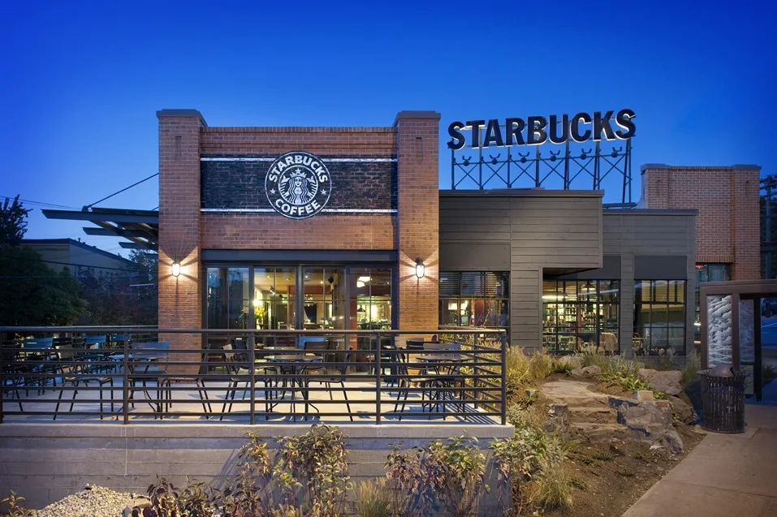

# Starbucks In Seattle Location Finder
Final group project repo for geog 458 course | GroupAB3 (Gunhee, Haochen, Sophia L, Sophia S)

## Web Map Link
[Starbucks in Seattle Map](https://sophial25.github.io/Final-Project/)

## Project idea
We will be creating a web map featuring the brand of starbucks stores in the city of Seattle. The data set includes the locations of each store in Seattle, which we will be visualizing this locations and provide users enough information about the particular store. 

## Project significance and broader impacts
Some of significant impacts and broader implcations include helping people find the coffee shops, and knowing its origins and unique work cultures. This project helps promote local businessess by providing the information about the locations. etc. Though starbucks is a huge brand that may not require us to advertise them, but it provides the support the people who work there.

For the broader impacts, this project can highlight the importance of data cleaning and processing, and as well as demonstrating the power of geospatial technology. We are able to use it create a web map that provides a valuable service to people, which can solve real-world problems and has broader implicaitons for the use of geospatial technology in many fields.

Some negative impact that the project may have is privacy concerns. The dataset I am using includes the street address of each starbucks store. While the information is publically available, some people would much prefer their homes or address displayed on the public map. To avoid violating the provacy, we thought of store locations by zip code or using heat map that shows the concenrtrations of stores in a given data without giving specific address.

## Primary functions and major data sources
#### Primary functions
- Toggle buttons or layers to display different service options (drive-through, dine-in, delivery)
- A search bar to allow users to search for a specific store by name or address
- A buffer zone to show stores within a certain radius of a location
- Zoom in and out functions to allow users to focus on specific areas
- A pop-up window to show more detailed information about each Starbucks store, including the address, service options, and ratings.

#### Dataset
[Starbucks Stores in Seattle](https://www.kaggle.com/datasets/kukuroo3/starbucks-locations-worldwide-2021-version?resource=download)

The original dataset comes from Kaggle which is quite credible and contained worldwide Starbucks locations in 2021, but we cleaned the dataset to focus on Seattle area only where there’s relatively more Starbucks stores than any other cities in the U.S. We removed the unnecessary 5 columns and kept columns like longitude, latitude, zipcode, street address and etc as well as removed NA or NAN values for a better compatibility when loading in the map. Lastly, we filtered out only Seattle from city and US from country code so that we can use Seattle only out of worldwide data.

## Targeted audience
Seattle’s coffee enthusiasts, tourists who visit Seattle, city planners, and basically anyone who drinks coffee, loves starbucks and is particularly looking for a certain type of Starbucks store. Also people who are trying to open up their coffee shop might be helpful so that they can avoid the duplicate area.

## Multimedia
- [Seattle | Starbucks Reserve Roastery](https://www.youtube.com/watch?v=s6AgzclRCJE)
- [Your Seattle Starbucks Checklist](http://www.starbucksmelody.com/2018/11/24/starbucks-checklist/)
- [Starbucks Dominates the Coffee Market in Seattle](https://www.thecommonscafe.com/starbucks-dominates-the-coffee-market-in-seattle/)
- [Starbucks: A Legendary Washington State Business Since 1971](http://choosewashingtonstate.com/success-stories/starbucks/)

 [link](https://www.cntraveler.com/bars/seattle/starbucks-reserve-roastery)
[link](https://www.seattlemet.com/eat-and-drink/2015/08/every-single-starbucks-in-seattle-ranked)
 [link](https://wisconsinexaminer.com/wp-content/uploads/2022/02/starbucks-g489067a76_1920-1024x683.jpg)

## Project Format : Generic digital geographies project
For this project, we will be using the web mercator projection, which is commonly used for web mapping applications. We will set the initial zoom level to display the entire city of Seattle and allow users to zoom in and out as needed. The center of the map will be set to the geographic center of seattle.

#### Base map:
We will use the Mapbox's light version v1 to provide user more easier view of Seattle area and focused more on the locations of starbucks stores rather other different locations of other things.

#### Thematics layers:
We will create three thematic layers representing starbucks stores in Seattle with different service options: drive-throughs, dine-in, and delivery. Each layer will use a different visual startegy to differentiate between the service options

#### Drive-through layer:
We will use a proportional symbol map to represent each starbucks store with a drive-through option. The size of the symbol will be proportional to the number of drive-through stores in the surrounding area.

#### Dine-in layer:
We will use a choropleth map to represent the distribution of dine-instarbucks stores across the Seattle area. The choropleth will use various different colors to represent the density of stores in each area(zip code).

#### Delivery layer:
We will use a heatmap to show the density of delivery starbucks stores across Seattle. The heatmap will use different colors to represent the integrity of delivery store locations

#### Raster layers:
We will use raster layers for our thematic maps, based on the service option attribute being used to differentiate different layers.

#### Addtional Dataset:
We will also emply additional data soruces to supplement our maps, such as population density data and traffic data to help identify areas of high demand for each service option.
