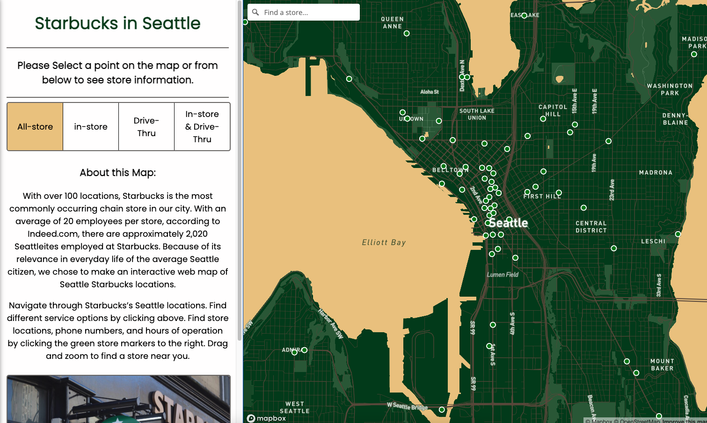
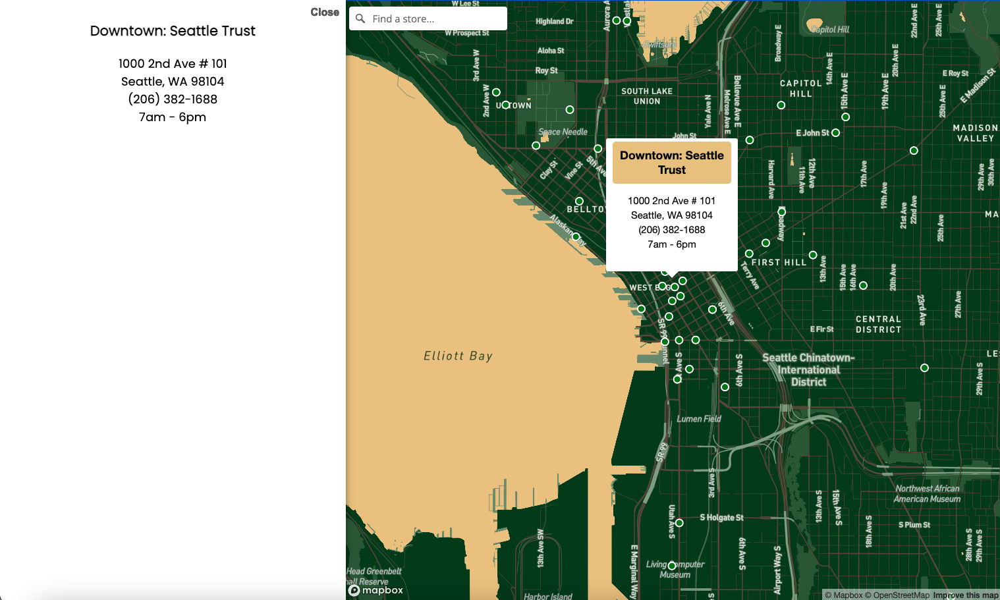
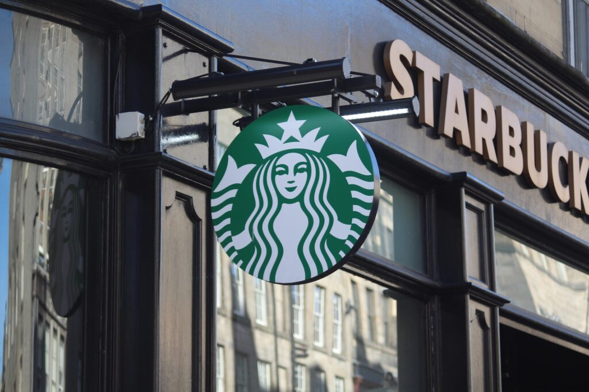

# Starbucks In Seattle Location Finder
Final Project Repository for GEOG 458 course at UW | GroupAB3 (Gunhee, Haochen, Sophia L, Sophia S)

## Web Map Link
### [Starbucks in Seattle Map](https://sophial25.github.io/Final-Project/)
 

## Project Description
We will be creating a web map featuring the brand of starbucks stores in the city of Seattle. The data set includes the locations of each store in Seattle, which we will be visualizing this locations and provide users enough information about the particular store. It will have four different layers that users can switch between so that they can pick which type of starbucks services they want - in-store only, drive-thru only, both, or jsut all locations in Seattle. 

## Project Goal & Significance
Some of significant impacts and broader implcations include helping people find the coffee shops, and knowing its origins and unique work cultures. This project helps promote local businessess by providing the information about the locations. etc. Though starbucks is a huge brand that may not require us to advertise them, but it provides the support the people who work there.

For the broader impacts, this project can highlight the importance of data cleaning and processing, and as well as demonstrating the power of geospatial technology. We are able to use it create a web map that provides a valuable service to people, which can solve real-world problems and has broader implicaitons for the use of geospatial technology in many fields.

Possible targeted audiences with this project would be Seattle’s coffee enthusiasts, tourists who visit Seattle, city planners, and basically anyone who drinks coffee, loves starbucks and is particularly looking for a certain type of Starbucks store. Also people who are trying to open up their coffee shop might be helpful so that they can avoid the duplicate area.

## Primary Functions and Major Data Sources

#### Primary functions
- 4 different toggle layers(buttons) to display different service options (all store, in-store, drive-through, in-store and drive-through)
- A search bar to allow users to search for a specific store or area by name or address
- Flyto and Zoom in/out functions to allow users to focus on specific areas by adding interactivity
- A pop-up window to show more detailed information about each Starbucks store, including the the store name, address, service options, and business hours.

#### Dataset
[Starbucks Stores in Seattle](https://www.kaggle.com/datasets/kukuroo3/starbucks-locations-worldwide-2021-version?resource=download)

The original dataset comes from Kaggle which is quite credible and contained worldwide Starbucks locations in 2021, but we cleaned the dataset to focus on Seattle area only where there’s relatively more Starbucks stores than any other cities in the U.S. We removed the unnecessary 5 columns and kept columns like longitude, latitude, zipcode, street address and etc as well as removed NA or NAN values for a better compatibility when loading in the map. Lastly, we filtered out only Seattle from city and US from country code so that we can use Seattle only out of worldwide data.

## Multimedia
- [Seattle | Starbucks Reserve Roastery](https://www.youtube.com/watch?v=s6AgzclRCJE)
- [Your Seattle Starbucks Checklist](http://www.starbucksmelody.com/2018/11/24/starbucks-checklist/)
- [Starbucks Dominates the Coffee Market in Seattle](https://www.thecommonscafe.com/starbucks-dominates-the-coffee-market-in-seattle/)
- [Starbucks: A Legendary Washington State Business Since 1971](http://choosewashingtonstate.com/success-stories/starbucks/)

 
 

Credits
- [Reserve](https://www.cntraveler.com/bars/seattle/starbucks-reserve-roastery)
- [Store](https://www.seattlemet.com/eat-and-drink/2015/08/every-single-starbucks-in-seattle-ranked)
- [Starbucks Logo](https://wisconsinexaminer.com/wp-content/uploads/2022/02/starbucks-g489067a76_1920-1024x683.jpg)

## Project Details

#### Project Format : Generic digital geographies project
For this project, we will be using the web mercator projection, which is commonly used for web mapping applications. We will set the initial zoom level to display the entire city of Seattle and allow users to zoom in and out as needed. The center of the map will be set to the geographic center of seattle.

#### Layers : Raster layers
- Base map: We will use the Mapbox's light version v1 to provide user more easier view of Seattle area and focused more on the locations of starbucks stores rather other different locations of other things.

#### Applied Libraries 
- Mapbox GL JS : Major JS library to visualize, query, and display geojson data
- Turf : Created geocoder(search bar)
- QGIS : Created tileset using personalized thematic map
- Mapbox Studio : Created personalized style of Starbucks-themed map

## Acknowledgement
Special thanks to professor Bo Zhao and our Teaching Assistant Steven Bao at University of Washington for having this opportunity to develop our own web map with lots of feedbacks and help. 
